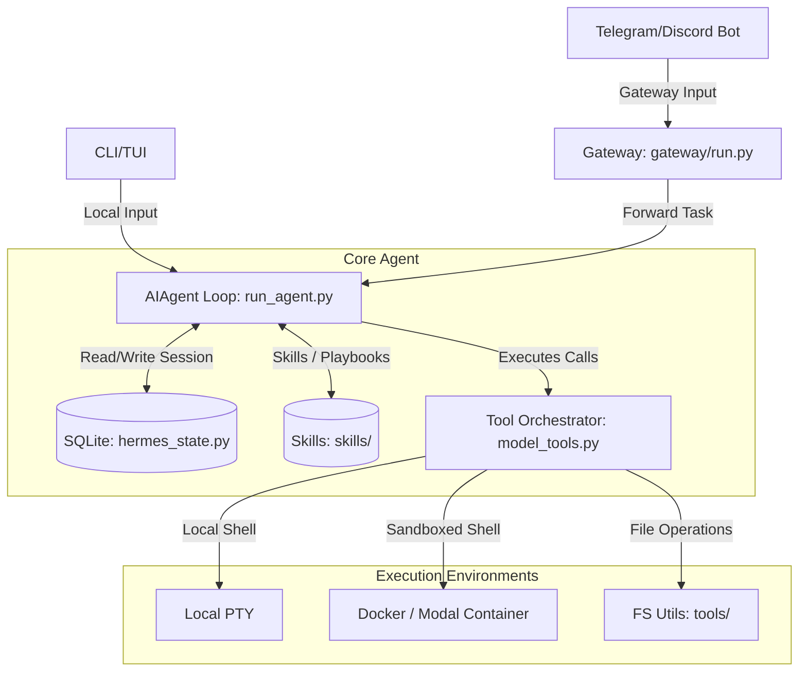

# Hermes Agent Research Summary & Architecture Review

This document provides a comprehensive research summary of **Hermes Agent** (developed by Nous Research). It explores how to use it, its core benefits, key use cases, and a detailed breakdown of its system architecture to guide our development of the **Bludai Agent CLI** (using Python and LangGraph).

---

## 1. How to Use Hermes Agent

Hermes Agent is designed as a personal AI assistant that can be operated through multiple interfaces:

### Interface Options

* **Terminal CLI/TUI:** Run `hermes` in your shell to start a rich, interactive text user interface (TUI) with autocomplete, multiline editing, and live tool execution logs.
* **Messaging Platforms:** Run `hermes gateway start` to connect the agent to messaging apps like Telegram, Discord, Slack, WhatsApp, and Signal. You can interact with the agent from these apps while it executes commands on your local PC or a cloud server.
* **Desktop Companion:** An Electron-based desktop app (Hermes Desktop) provides a graphical dashboard.
* **API Server / VS Code / JetBrains (ACP):** Supports the Agent Client Protocol (ACP) to act as a coding copilot directly inside IDEs.

### Essential Commands

* `hermes` — Starts the interactive chat CLI.
* `hermes setup` — Runs the initial setup wizard to configure providers, API keys, and platforms.
* `hermes model` — Interactive model selector (supports 300+ models via OpenRouter, Gemini, OpenAI, etc.).
* `hermes tools` — Toggles which system/file/shell tools are enabled for the agent.
* `hermes gateway start` — Boots the messaging bridge (e.g., Telegram connection).
* `/model [name]` — Changes the model during an active session (e.g. `/model google/gemini-2.5-flash:free`).
* `/new` or `/reset` — Clears conversation history and starts a fresh session.
* `/<skill-name>` — Activates a specific skill playbook (e.g., `/tdd` to enforce test-driven development).

---

## 2. Benefits of Using Hermes Agent

* **Self-Improving Learning Loop (Procedural Memory):** Unlike typical chatbots that forget what they did, Hermes reflects on its work. If it solves a complex problem, it summarizes the solution and writes a **Skill** file (`SKILL.md`) so it can reuse that knowledge in future sessions.
* **Decoupled Reach (Run anywhere, talk from anywhere):** You can install Hermes on a cheap cloud VPS or your local home computer, but talk to it entirely through Telegram. It brings agentic command-line capabilities directly to your mobile phone.
* **Prompt-Cache Efficiency:** Hermes is architected around preserving LLM prompt caching. System prompts are kept byte-stable, and skill injections are performed as user messages, saving significant token costs.
* **Rich Tool Integration:** Out of the box, it supports terminal command execution, filesystem CRUD operations, web browsing (via Playwright/Firecrawl), and integrations like Home Assistant and GitHub.
* **Isolated Subagents:** It can spawn parallel subagents to handle complex multi-step pipelines without bloating the main conversation context.

---

## 3. Core Use Cases

### A. Autonomous Software Development

* **Test-Driven Development (TDD):** Enforces a strict Red-Green-Refactor cycle. The agent writes tests, runs them to watch them fail, writes code to pass, and refactors under user approval.
* **Systematic Debugging:** Analyzes stack traces, writes print/log statements, executes scripts, and traces bugs step-by-step.
* **Code Reviews:** Analyzes local git diffs and provides reviews based on user-configured coding standards.

### B. Scheduled Automation & DevOps

* **Cron-scheduled Jobs:** You can configure the agent to run cron jobs (e.g., *"every night at 11 PM, check system disk usage, search for error logs, and send me a summary report on Telegram"*).
* **Repository Maintenance:** Automates code formatting, runs dependency audits, and automatically creates pull requests.

### C. Personal Productivity & Smart Home

* **Smart Home Control:** Integrates with Home Assistant to control local IoT devices via natural language from Telegram.
* **Dynamic Researching:** Searches the web, reads multiple documentation pages, and summarizes topics directly into markdown files in your workspace.

---

## 4. Architectural Analysis (The "Developer's Lens")



### Key Architectural Modules

#### A. The AIAgent Loop (`run_agent.py`)

At the core is the `AIAgent` class. It manages a synchronous, budget-constrained loop that wraps the LLM chat completion calls:

1. Loads conversation history from the SQLite database (`SessionDB` in `hermes_state.py`).
2. Prepares tool schemas (only adding enabled toolsets to keep token counts small).
3. Calls the model.
4. If the model calls a tool:
   * Executes the tool via `handle_function_call()` in `model_tools.py`.
   * Appends the tool result to the message list.
   * Checks for user interrupts (`Ctrl+C` or a `/stop` command).
   * Loops back to step 3 (up to `max_iterations` or budget exhaustion).
5. If no tool is called, returns the final text response.

#### B. The Skill System (`skills/`)

Skills are defined in directory-based markdown files with YAML frontmatter:

```yaml
---
name: plan
description: "Decompose complex tasks into a structured checklist."
version: 1.0.0
platforms: [linux, macos, windows]
---
# Plan Skill Instructions...
```

When a user runs a slash command like `/plan`, the agent loads this markdown file and appends it to the conversation history as a user message. This tells the LLM exactly how to proceed with the planning protocol. This is incredibly token-efficient and maintains the prompt cache.

#### C. The Messaging Gateway (`gateway/`)

The gateway is a separate long-running process that listens for inbound events from various chat platforms (Telegram, Discord, Slack, etc.) and routes them to the agent's core conversation loop. It maintains a mapping of Telegram Chat IDs to specific Hermes Session IDs, enabling multi-user sandboxing and conversational continuity.

---

## Lessons for Bludai Agent CLI (Python + LangGraph)

As we build our own CLI multi-agent system, we should adapt several excellent design decisions from Hermes:

1. **Keep the core waist narrow:** Do not add too many tool schemas by default. Keep tool definitions modular and let the supervisor agent dynamically select them.
2. **Stateful Session Database:** Use a local SQLite database to store chat histories and task checklists, just like Hermes' `SessionDB`.
3. **Task Decomposition:** Adopt the "Plan" skill structure where the Manager agent decomposes a goal into a checklist and updates it in-memory.
4. **Security & Shell Approval:** Ensure that any terminal command execution is gated by user confirmation (interactive prompt in CLI or `/approve` in Telegram).
